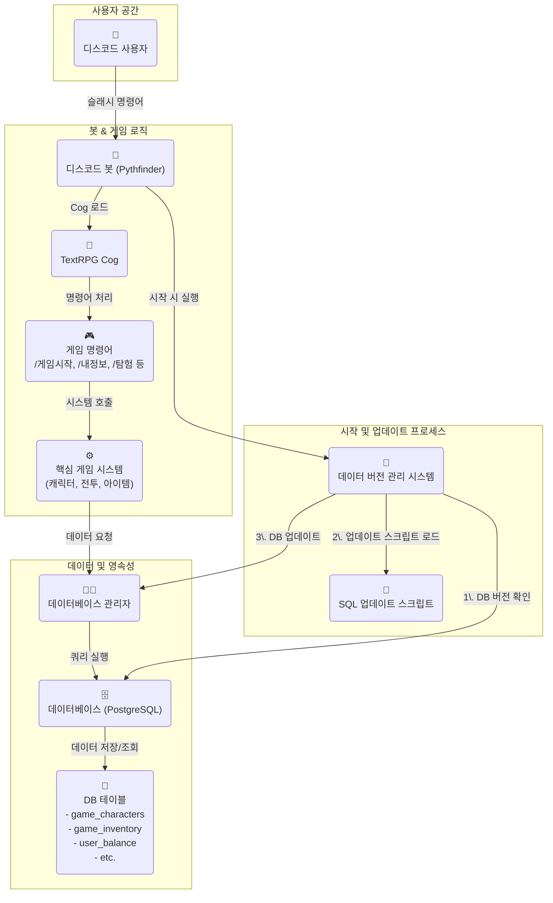

# 게임 기획서: 던전 앤 디스코드 (Dungeons & Discord)

**1. 개요 (Overview)**

*   **게임 제목**: 던전 앤 디스코드 (Dungeons & Discord)
*   **장르**: 텍스트 기반 클래식 로그라이크 (Text-based Classic Roguelike)
*   **핵심 컨셉**: Discord에서 즐기는, 절차적으로 생성된 던전을 탐험하며 매번 새로운 경험을 제공하는 하드코어 텍스트 로그라이크. 영구적 죽음(Permadeath)을 특징으로 하며, 깊은 전략과 신중한 판단을 요구합니다.
*   **참고 문서**: 상세한 게임 디자인은 `docs/game_design_detail.md` 문서를 참고합니다.

**2. 핵심 기능 (Core Features)**

*   **절차적 생성 (Procedural Generation)**: 플레이할 때마다 던전의 구조, 몬스터와 아이템의 배치가 완전히 바뀌어 매번 새로운 도전을 제공합니다.
*   **영구적 죽음 (Permadeath)**: 캐릭터가 사망하면 해당 캐릭터의 모든 진행 상황(레벨, 아이템)은 영구적으로 사라지고, 기록은 '묘비'에 남습니다.
*   **다양한 캐릭터 빌드**: 여러 **종족**과 **직업**의 조합을 통해 수십 가지의 다양한 플레이 스타일을 즐길 수 있습니다.
*   **턴 기반 전투 및 탐험**: 플레이어가 행동할 때만 게임 세계의 시간이 흐르며, 이를 통해 신중한 결정을 내릴 수 있습니다.
*   **아이템 식별 (Item Identification)**: 처음 발견한 아이템의 효과는 알 수 없으며, 직접 사용하거나 다른 방법을 통해 '식별'해야 하는 재미를 제공합니다.
*   **자원 관리**: 체력(HP), 마나(MP)뿐만 아니라 **식량** 등 한정된 자원을 효율적으로 관리해야 합니다.
*   **공물 및 계약 시스템 (Tribute & Covenant System)**: 던전의 '석판'에 공물을 바쳐 `공헌도`를 쌓고, 이를 통해 강력하지만 위험한 '계약'을 맺어 특별한 능력을 얻는 시스템입니다. 플레이어의 선택에 따라 리스크와 보상이 결정됩니다.

**3. 명령어 (Commands)**

*   `/탐험시작`: 종족과 직업을 선택하여 새로운 모험(캐릭터)을 시작합니다.
*   `/내정보`: 현재 살아있는 캐릭터의 상태(스탯, 장비, 자원 등)를 확인합니다.
*   `/탐험`: 던전 탐험을 계속합니다. (이동, 조사 등)
*   `/인벤토리`: 보유 아이템을 확인하고 사용합니다.
*   `/전적`: 사망한 캐릭터들의 기록(묘비)을 확인합니다.
*   `/상점`: (향후 구현) 마을에 있을 때 아이템을 구매하거나 판매합니다.

**4. 데이터베이스 구조 (Database Schema)**

*   **`game_characters`**: 현재 진행 중인 **살아있는** 유저 캐릭터 정보를 저장합니다.
    *   `character_id` (PK), `user_id`, `name`, `race`, `class`, `level`, `hp`, `max_hp`, `mp`, `max_mp`, `attack`, `defense`, `exp`, `next_exp`, `food`, `dungeon_level`, `created_at` 등
*   **`game_character_history`**: **사망하거나 승리한** 캐릭터의 최종 기록을 저장합니다. (묘비 기능)
    *   `history_id` (PK), `user_id`, `name`, `race`, `class`, `level`, `cause_of_death`, `cleared_dungeon_level`, `play_time`, `end_time` 등
*   **`game_inventory`**: 유저가 소유한 아이템을 저장합니다.
    *   `inventory_id` (PK), `character_id`, `item_id`, `quantity`, `is_equipped`, `is_identified`
*   **`game_races`**, **`game_classes`**: 종족과 직업의 마스터 데이터입니다.
*   **`game_items`**, **`game_monsters`**: 아이템과 몬스터의 마스터 데이터입니다.
*   **`game_data_versions`**: 각 게임 데이터(아이템, 몬스터, 종족, 직업 등)의 버전을 관리합니다.
*   **`game_covenants`**: 계약의 마스터 데이터를 저장합니다. (이름, 설명, 조항 등)
*   **`game_character_covenants`**: 캐릭터가 맺은 계약의 상태를 저장합니다. (`character_id`, `covenant_id`, `contribution_score` 등)

**5. 개발 단계 (Development Phases)**

1.  **Phase 1: 기반 재설계**: **영구적 죽음**을 지원하는 DB 구조로 변경, **종족/직업** 시스템 기반 구현. `/탐험시작` 시 종족/직업 선택 기능, 수정된 `/내정보` 명령어 구현.
2.  **Phase 2: 탐험 및 전투 시스템**: 절차적 던전 생성, 시야(FoV) 시스템, 턴 기반 전투의 핵심 로직 구현.
3.  **Phase 3: 아이템 및 자원 관리**: **아이템 식별** 시스템 및 **식량** 자원 관리 시스템 구현.
4.  **Phase 4: 공물 및 계약 시스템**: 던전 내 '석판' 오브젝트 및 상호작용 구현. '공물'을 통해 `공헌도`를 쌓고 '계약'을 해금하는 시스템 개발. 계약의 '권능'과 '반발' 효과 구현.
5.  **Phase 5: 고도화**: `/전적`(묘비) 기능, 스킬/마법 시스템, 계약 압박 완화 장치('고요의 부적' 등) 구현 및 콘텐츠 확장.

**6. 데이터 및 버전 관리 (Data & Version Management)**

*   **필요성**: 새로운 아이템, 몬스터, 퀘스트 등 정적 데이터를 코드와 함께 업데이트할 때, 수동으로 `/db실행` 명령을 사용하는 것은 실수를 유발할 수 있고 번거롭습니다. 데이터 버전 관리 시스템을 도입하여 이 과정을 자동화하고 안정성을 높입니다.
*   **통합 관리**: 본 프로젝트는 **코드 버전(Git)**과 **데이터 버전(DB)**을 함께 관리합니다.
    *   **코드 버전**: `cogs/version.py`가 관리하며, 봇의 기능 및 로직의 버전을 의미합니다.
    *   **데이터 버전**: `cogs/text_rpg.py`가 관리하며, 아이템/몬스터 등 게임 데이터의 버전을 의미합니다.
    *   `/버전` 명령어를 통해 코드와 데이터의 버전을 통합하여 확인할 수 있습니다.
*   **프로세스**:
    1.  **버전 정의**: 코드 내(예: `cogs/text_rpg.py`)에 각 데이터 타입(아이템, 몬스터 등)의 최신 버전을 상수로 정의합니다. (예: `LATEST_ITEM_VERSION = 2`)
    2.  **버전 확인**: 봇이 시작될 때, `game_data_versions` 테이블에 저장된 현재 데이터베이스의 버전과 코드에 정의된 최신 버전을 비교합니다.
    3.  **자동 업데이트**: 데이터베이스 버전이 코드 버전보다 낮은 경우, 해당 버전까지의 모든 업데이트 스크립트(예: `sql/updates/items_v2.sql`, `sql/updates/monsters_v2.sql`)를 순차적으로 자동 실행합니다.
*   **기대 효과**:
    *   개발자는 데이터 추가/수정 시 SQL 업데이트 파일만 작성하면 되므로, 배포 과정이 단순해집니다.
    *   항상 코드와 데이터베이스의 정합성이 보장됩니다.

**7. 시스템 아키텍처 다이어그램 (System Architecture Diagram)**

