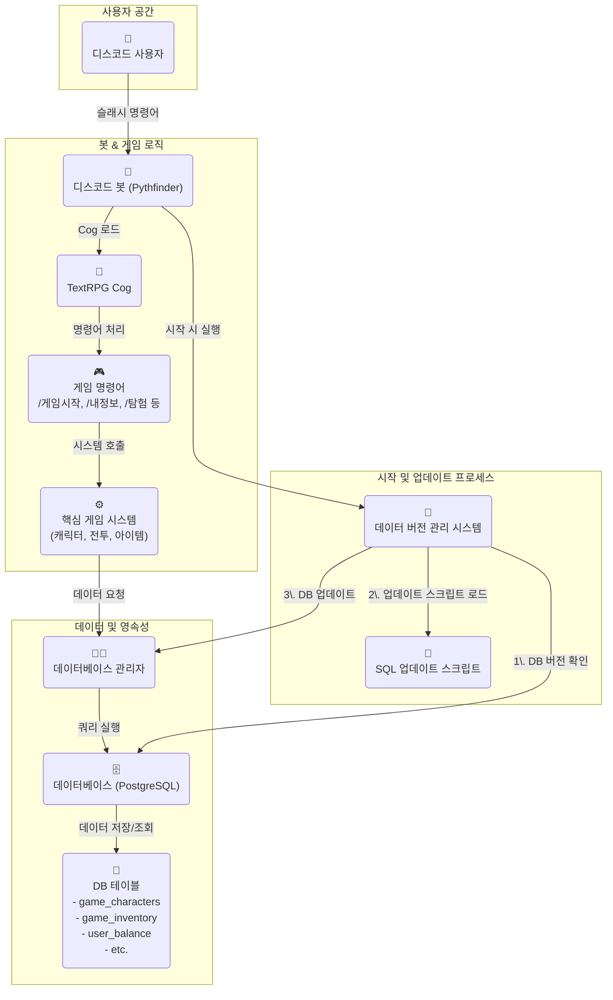

# 게임 기획서: 던전 앤 디스코드 (Dungeons & Discord)

**1. 개요 (Overview)**

*   **게임 제목**: 던전 앤 디스코드 (Dungeons & Discord)
*   **장르**: 텍스트 기반 RPG (Text-based RPG)
*   **플랫폼**: 디스코드 봇
*   **핵심 컨셉**: 유저는 디스코드 서버 내에서 간단한 명령어를 통해 가상의 던전을 탐험하고, 몬스터와 싸우고, 아이템을 획득하며 성장하는 텍스트 기반 RPG입니다. 기존 봇의 경제 시스템과 연동하여 게임 내 재화를 획득하거나 사용할 수 있습니다.

**2. 핵심 기능 (Core Features)**

*   **캐릭터 시스템**:
    *   각 유저는 고유한 캐릭터를 가집니다.
    *   주요 스탯: 레벨(Level), 체력(HP), 공격력(Attack), 방어력(Defense), 경험치(EXP)를 가지며, 데이터는 데이터베이스에 저장됩니다. (`game_characters` 테이블 신규 생성)

*   **탐험 시스템 (Exploration)**:
    *   `/탐험` 명령어로 던전의 새로운 방으로 이동하며, 몬스터 출현, 보물 발견, 함정 등 무작위 이벤트가 발생합니다.
    *   `discord.ui.View`와 `Button`을 사용하여 "계속 탐험하기", "마을로 돌아가기" 등의 선택지를 제공합니다.

*   **전투 시스템 (Combat)**:
    *   턴 기반으로 진행되며 `공격`, `도망` 등의 행동을 선택할 수 있습니다.
    *   전투 로그는 메시지 수정을 통해 실시간으로 보여주고, 승리 시 경험치와 재화를, 패배 시 탐험을 종료하고 마을로 돌아갑니다.

*   **아이템 및 인벤토리**:
    *   `/인벤토리` 명령어로 보유한 아이템을 확인하고, 소비 아이템과 장비 아이템을 관리합니다. (`game_inventory` 테이블 신규 생성)

*   **상점 시스템**:
    *   `/상점` 명령어로 아이템을 구매하거나 판매할 수 있으며, 기존의 `user_balance`와 연동하여 봇의 재화를 사용합니다.

**3. 명령어 (Commands)**

*   `/게임시작`: 게임 캐릭터를 생성합니다.
*   `/내정보`: 캐릭터의 현재 상태(스탯, 레벨, 장비)를 확인합니다.
*   `/탐험`: 던전 탐험을 시작하거나 계속합니다.
*   `/인벤토리`: 보유 아이템을 확인하고 사용합니다.
*   `/상점`: 아이템을 구매하거나 판매합니다.

**4. 데이터베이스 구조 (Database Schema)**

*   **`game_characters`**: 유저의 캐릭터 정보를 저장합니다.
    *   `user_id`, `level`, `hp`, `max_hp`, `attack`, `defense`, `exp` 등
*   **`game_inventory`**: 유저가 소유한 아이템을 저장합니다.
    *   `user_id`, `item_id`, `quantity` 등
*   **`game_items`**: 게임 내 아이템의 마스터 데이터입니다.
*   **`game_monsters`**: 몬스터의 마스터 데이터입니다.
*   **`game_data_versions`**: 각 게임 데이터(아이템, 몬스터 등)의 버전을 관리합니다.
    *   `data_type` (e.g., 'items', 'monsters'), `version`

**5. 개발 단계 (Development Phases)**

1.  **Phase 1: 기본 틀 구축**: `text_rpg.py` cog 파일 및 DB 테이블 생성, **데이터 버전 관리 시스템 구현**, `/게임시작`, `/내정보` 명령어 구현
2.  **Phase 2: 탐험 및 전투 시스템 구현**: `/탐험` 및 기본 전투 시스템 구현
3.  **Phase 3: 아이템 및 상점 시스템 구현**: `/인벤토리`, `/상점` 명령어 및 재화 연동 구현
4.  **Phase 4: 고도화**: 장비 시스템, 다양한 콘텐츠, 랭킹 등 추가

**6. 데이터 및 버전 관리 (Data & Version Management)**

*   **필요성**: 새로운 아이템, 몬스터, 퀘스트 등 정적 데이터를 코드와 함께 업데이트할 때, 수동으로 `/db실행` 명령을 사용하는 것은 실수를 유발할 수 있고 번거롭습니다. 데이터 버전 관리 시스템을 도입하여 이 과정을 자동화하고 안정성을 높입니다.
*   **통합 관리**: 본 프로젝트는 **코드 버전(Git)**과 **데이터 버전(DB)**을 함께 관리합니다.
    *   **코드 버전**: `cogs/version.py`가 관리하며, 봇의 기능 및 로직의 버전을 의미합니다.
    *   **데이터 버전**: `cogs/text_rpg.py`가 관리하며, 아이템/몬스터 등 게임 데이터의 버전을 의미합니다.
    *   `/버전` 명령어를 통해 코드와 데이터의 버전을 통합하여 확인할 수 있습니다.
*   **프로세스**:
    1.  **버전 정의**: 코드 내(예: `cogs/text_rpg.py`)에 각 데이터 타입(아이템, 몬스터 등)의 최신 버전을 상수로 정의합니다. (예: `LATEST_ITEM_VERSION = 2`)
    2.  **버전 확인**: 봇이 시작될 때, `game_data_versions` 테이블에 저장된 현재 데이터베이스의 버전과 코드에 정의된 최신 버전을 비교합니다.
    3.  **자동 업데이트**: 데이터베이스 버전이 코드 버전보다 낮은 경우, 해당 버전까지의 모든 업데이트 스크립트(예: `sql/updates/items_v2.sql`, `sql/updates/monsters_v2.sql`)를 순차적으로 자동 실행합니다.
*   **기대 효과**:
    *   개발자는 데이터 추가/수정 시 SQL 업데이트 파일만 작성하면 되므로, 배포 과정이 단순해집니다.
    *   항상 코드와 데이터베이스의 정합성이 보장됩니다.

**7. 시스템 아키텍처 다이어그램 (System Architecture Diagram)**

