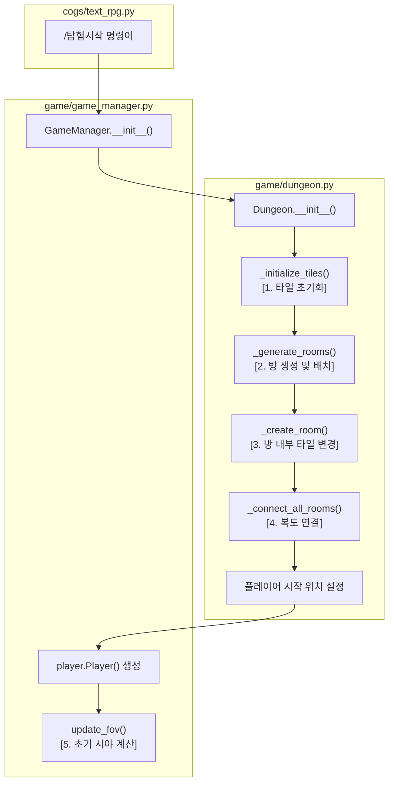

# 던전 맵 생성 알고리즘 상세 분석

이 문서는 Pythfinder 텍스트 RPG의 던전 맵이 생성되는 과정을 상세히 기술합니다. 맵 생성 로직을 수정하거나 새로운 알고리즘을 개발할 때 이 문서를 참고할 수 있습니다.

## 주요 관련 파일

*   `game/game_manager.py`: 게임의 전체 흐름을 관리하며, 던전 생성을 시작시키는 주체입니다.
*   `game/dungeon.py`: 실제 던전 생성의 모든 핵심 로직을 포함하고 있는 클래스입니다.
*   `game/fov.py`: 생성된 던전 위에서 플레이어의 시야를 계산합니다.

## 맵 생성 전체 순서도

맵 생성은 `/탐험시작`과 같은 명령어로 `GameManager`가 초기화될 때 시작됩니다. 전체적인 데이터 흐름은 다음과 같습니다.

## 단계별 상세 분석

### 1. 타일 초기화 (`Dungeon._initialize_tiles`)

*   `Dungeon` 객체가 생성되면 가장 먼저 호출됩니다.
*   던전의 전체 크기 (`DUNGEON_WIDTH`, `DUNGEON_HEIGHT`) 만큼 2차원 배열을 생성합니다.
*   모든 타일(Tile)을 이동 및 시야 통과가 불가능한 '벽(wall)'으로 초기화합니다.

### 2. 방 생성 및 배치 (`Dungeon._generate_rooms`)

*   무작위 위치와 크기로 방(Room)을 생성하는 과정을 반복합니다.
*   **생성 규칙**:
    *   방의 개수는 `MAX_ROOMS`를 초과할 수 없습니다.
    *   방의 크기는 `ROOM_MIN_SIZE`와 `ROOM_MAX_SIZE` 사이에서 무작위로 결정됩니다.
    *   새로 생성된 방은 기존에 배치된 어떤 방과도 겹치지 않아야 합니다. (`Room.intersects` 메서드로 확인)
*   겹치지 않는 유효한 방이 생성되면, 던전의 `rooms` 리스트에 추가됩니다.

### 3. 방 내부 타일 변경 (`Dungeon._create_room`)

*   `_generate_rooms` 메서드 내부에서 호출됩니다.
*   성공적으로 배치된 모든 방(Room) 객체에 대해, 해당 방의 내부 영역(테두리 제외)에 있는 '벽' 타일을 이동과 시야 통과가 가능한 '바닥(floor)' 타일로 교체합니다.

### 4. 복도 연결 (`Dungeon._connect_all_rooms` & `_connect_rooms`)

던전의 핵심적인 구조를 만드는 가장 복잡한 단계이며, 두 단계로 나뉩니다.

#### 4.1. 최소 연결 보장 (Minimum Spanning Tree)

*   **목표**: 모든 방이 최소 하나 이상의 경로로 연결되어, 플레이어가 모든 방에 도달할 수 있도록 보장합니다.
*   **과정**:
    1.  첫 번째 방을 '연결된 그룹'에 추가합니다.
    2.  '연결되지 않은 그룹'의 방들 중에서, '연결된 그룹'의 방들과 가장 거리가 가까운 방을 선택합니다.
    3.  이 두 방을 잇는 복도를 생성합니다. (`_connect_rooms` 호출)
    4.  모든 방이 '연결된 그룹'에 포함될 때까지 이 과정을 반복합니다.

#### 4.2. 추가 연결 생성 (순환로)

*   **목표**: 단조로운 외길 구조를 피하고, 던전에 다양한 경로와 순환로를 만들어 탐험의 재미를 더합니다.
*   **과정**:
    *   모든 방을 순회하며, `ADDITIONAL_CONNECTION_CHANCE` 확률에 따라 가까운 다른 방과 추가적인 복도를 생성할지 결정합니다.
    *   이는 이미 연결된 방들 사이에도 새로운 길을 만들 수 있습니다.

#### 4.3. 경로 탐색 및 복도 생성 (`_find_path_astar` & `_carve_path`)

*   두 방을 연결하기로 결정되면, A* (A-Star) 알고리즘을 사용하여 두 방 사이의 최적 경로를 탐색합니다.
*   **A\* 비용 함수 (`_get_path_cost`)**:
    *   일반 '벽'을 통과하는 비용은 1.0입니다.
    *   이미 생성된 '바닥'(다른 복도)을 재활용하는 비용은 0.5로 더 저렴합니다.
    *   다른 방의 영역을 침범하는 경로에는 매우 높은 비용(100.0)을 부과하여 사실상 해당 경로를 피하게 만듭니다.
*   경로가 확정되면 `_carve_path` 함수가 해당 경로의 '벽' 타일들을 '바닥' 타일로 교체하여 복도를 완성합니다.

#### 4.4. 문 생성 (`_carve_path` 내부 로직)

**문은 복도를 만드는 과정(`_carve_path`)에서 조건부로 생성됩니다.**

*   **생성 시점**: A\* 알고리즘으로 찾은 경로의 '벽'을 '바닥'으로 바꾸는 과정에서 생성됩니다.
*   **생성 조건**:
    1.  해당 위치가 '벽' 타일이어야 합니다.
    2.  `DOOR_CHANCE_PER_ROOM` (0.0 ~ 1.0) 확률을 통과해야 합니다.
    3.  하나의 복도에서는 단 하나의 문만 생성됩니다.
    4.  복도의 시작점이나 끝점 근처, 즉 방과 복도가 만나는 지점이어야 합니다.
    5.  `_is_valid_door_location` 검사를 통과해야 합니다. 이 검사는 해당 위치가 수직/수평 복도의 입구로서 적합한지 (예: 위아래는 벽, 좌우는 바닥과 벽으로 이루어져 있는지) 확인합니다.

### 5. 초기 시야 계산 (`GameManager.update_fov`)

*   맵 생성이 완료되고 플레이어 위치가 정해지면 `GameManager`는 `update_fov`를 호출합니다.
*   `game/fov.py`의 `compute_fov` 함수는 플레이어 위치를 중심으로 광선 투사(Ray-casting) 알고리즘을 실행합니다.
*   이를 통해 플레이어의 시야(`FOV_RADIUS` 반경) 안에 있는 타일들은 `visible` 상태가 되고, 한 번이라도 `visible`이었던 타일들은 영구적으로 `explored` 상태가 됩니다.

## 주요 설정값 (Parameters)

`game/dungeon.py` 상단에서 다음 값들을 수정하여 생성되는 던전의 특성을 조절할 수 있습니다.

*   `DUNGEON_WIDTH`, `DUNGEON_HEIGHT`: 던전의 전체 크기
*   `MAX_ROOMS`: 던전에 생성될 최대 방 개수
*   `ROOM_MIN_SIZE`, `ROOM_MAX_SIZE`: 방의 최소/최대 크기
*   `ADDITIONAL_CONNECTION_CHANCE`: 순환로를 만들 추가 복도 생성 확률
*   `DOOR_CHANCE_PER_ROOM`: 복도 입구에 문이 생성될 확률 